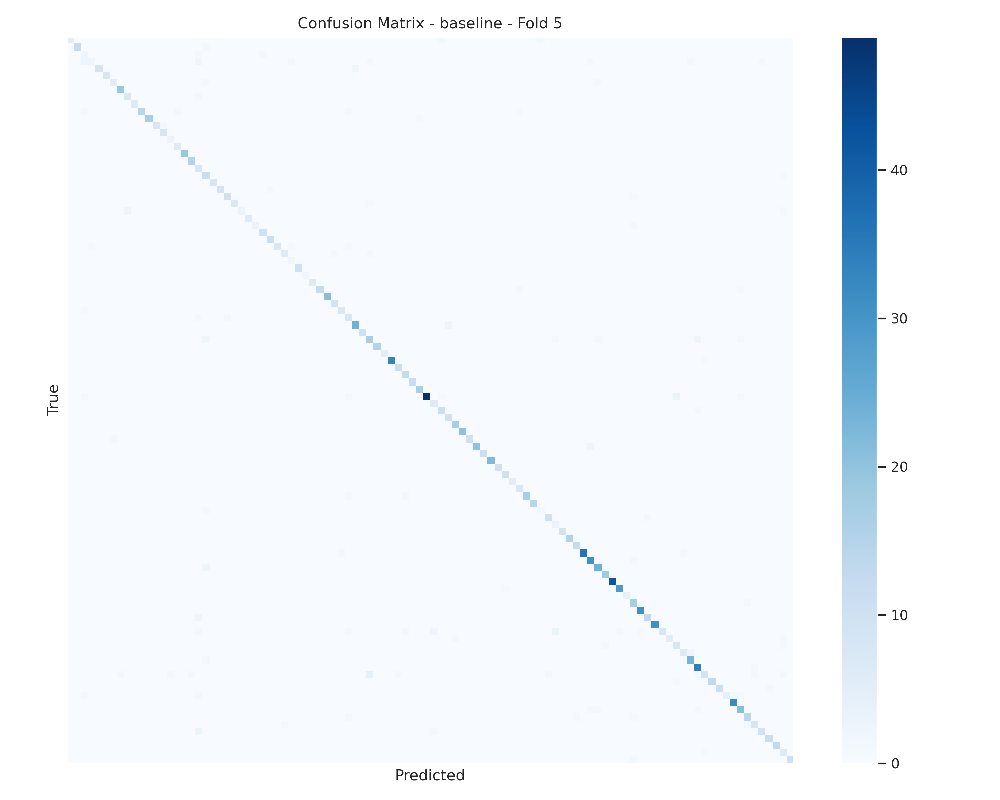

# Oxford 102 Flowers 图像分类实验结果

> **📅 实验日期:** 2025-11-23 16:09
>
> **🏷️ 任务类型:** 细粒度图像分类 (Fine-Grained Image Classification)


## 1. 实验环境 (Experimental Environment)

| 组件 | 规格/版本 | 备注 |
| :--- | :--- | :--- |
| **OS** | Rocky Linux 9.6 | |
| **GPU** | NVIDIA RTX V100 (32GB) | CUDA 13.0 |
| **Framework** | torch  2.6.0+cu118 | |
| **Python** | 3.9.21 | |
| **主要库** | torchvision 0.14, scikit-learn, matplotlib | |

## 2. 数据集介绍 (Dataset Overview)

1、**数据集名称:** Oxford 102 Flowers

2、**类别数量:** 102 类，总共8189张图片

3、**数据划分 (Split):**

Train set: `6149` 张

Validation set: `1020` 张

Test set: `1020` 张

> 数据集划分：
>
> 将`Train set`和`Validation set`合并得到一个新的数据集，然后进行5折交叉验证，保存每一折最好的结果在测试集上进行测试。


4、**预处理与增强 (Preprocessing & Augmentation):**


```python
train_validation_test_transform={
        'train_transforms': transforms.Compose([
            transforms.Resize((224, 224)),
            transforms.RandomHorizontalFlip(p=0.5),
            # 引入RandAugment
            transforms.RandAugment(num_ops=2, magnitude=9),  # 调整 num_ops 和 magnitude 以控制强度
            transforms.ToTensor(),
            transforms.Normalize((0.485, 0.456, 0.406), (0.229, 0.224, 0.225)),
            # 引入RandomErasing
            transforms.RandomErasing(p=0.25, scale=(0.02, 0.33), ratio=(0.3, 3.3), value='random')  # value='random' 使用随机像素值填充
        ]),
        'validation_transforms': transforms.Compose([
            transforms.Resize((256)),
            transforms.CenterCrop((224, 224)),
            transforms.ToTensor(),
            transforms.Normalize((0.485, 0.456, 0.406), (0.229, 0.224, 0.225))
        ]),
        'test_transforms': transforms.Compose([
            transforms.Resize((256)),
            transforms.CenterCrop((224, 224)),
            transforms.ToTensor(),
            transforms.Normalize((0.485, 0.456, 0.406), (0.229, 0.224, 0.225))
        ])
    }
```


## 3. 模型架构 (Model Architecture)

**Backbone:**  Resnet34

**Pretrained Weights:**   无

**分类头 (Head):** `Linear(in_features=2048, out_features=102)`

**参数量 (Params) 和 计算量 (FLOPs)** 

```
Resnet34 on Oxford Flowers102
Command:
Params (raw): 21336998.0
Params (str): 21.34 M
MACs (raw): 3679558758.0
MACs (str): 3.68 GMac
Estimated FLOPs (2*MACs): 7359117516.0
```

**主要改进点:**

*在此描述你对模型做的特殊修改，例如添加了 Attention 模块，修改了 Dropout 率等。*

## 4. 训练细节、超参数

 (Training Details and Hyperparameter)


**Epoch:**  2000， **Batch Size:**  64， **Learning Rate:** 0.0001， **Weight Decay:**  0.002


**Optimizer:**

```python
AdamW(model.parameters(),lr=args.lr,weight_decay=args.weight_decay)
```

**LR Scheduler:**

```python
scheduler = lr_scheduler.OneCycleLR(
            optimizer,
            max_lr=opt.lr * 5,  # 峰值学习率（通常为初始lr的3~10倍）
            steps_per_epoch=len(train_loader),
            epochs=opt.epochs,
            anneal_strategy='cos',  # 余弦退火
            pct_start=0.1,          # 10% 的时间用于 warm-up
            # div_factor=25.0,        # 初始学习率 = max_lr / div_factor
            # final_div_factor=1e4,   # 最低学习率 = max_lr / final_div_factor
            # three_phase=False       # 可选：是否三阶段策略
        )
```

> 📌 OneCycleLR 可有效替代传统学习率衰减策略，兼顾快速收敛与稳定训练。


**Loss Function：**

```python
criterion = nn.CrossEntropyLoss(label_smoothing=0.1).to(device)
```

> 使用 **带 Label Smoothing 的交叉熵损失（CrossEntropyLoss）**，能够缓解模型过自信、提升泛化能力，尤其在数据噪声较多或类别不均衡时效果显著。


**其他策略：**  


| 策略                  | 说明                                                         |
| :-------------------- | :----------------------------------------------------------- |
| **Early Stopping**    | (patience = 200), 监控验证指标，若连续 **200 个 Epoch** 无提升则提前停止训练，防止过拟合 |
| **Gradient Clipping** | 对梯度进行裁剪，防止梯度爆炸，提升训练稳定性                 |
| **数据加载并行**      | (num_workers = 4), 使用 **4 个 DataLoader Worker** 加速数据读取与增强 |


> **总训练时长：16 h 44 min 30 s**

## 5. 评估结果 (Evaluation Results)

### 5.1 5折交叉验证结果

| Fold     | Best Epoch | Accuracy    | Precision (micro) | Recall (micro) | Specificity | F1-score (micro) | Cohen's Kappa | Balanced Acc | AUROC      |
| -------- | ---------- | ----------- | ----------------- | -------------- | ----------- | ---------------- | ------------- | ------------ | ---------- |
| 1        | 429        | 0.9059      | 0.908             | 0.8953         | 0.9991      | 0.8936           | 0.9045        | 0.9472       | 0.9967     |
| 2        | 504        | 0.9073      | 0.9099            | 0.9036         | 0.9991      | 0.8988           | 0.9059        | 0.9513       | 0.9959     |
| 3        | 1311       | 0.9142      | 0.9176            | 0.9016         | 0.9991      | 0.9003           | 0.913         | 0.9504       | 0.9952     |
| 4        | 700        | 0.9142      | 0.918             | 0.9104         | 0.9991      | 0.9078           | 0.913         | 0.9548       | 0.9965     |
| 5        | 828        | 0.9114      | 0.8992            | 0.8988         | 0.9991      | 0.8868           | 0.9101        | 0.9489       | 0.994      |
| **Mean** | -          | 0.9106      | 0.91054           | 0.90194        | 0.9991      | 0.89746          | 0.9093        | 0.95052      | 0.99566    |
| **Std**  | -          | 0.003450797 | 0.006941931       | 0.005067386    | 0           | 0.007004456      | 0.003538926   | 0.002552959  | 0.00098102 |


核心指标分析：


| Metric           | Mean Score | Analysis                                       |
| ---------------- | ---------- | ---------------------------------------------- |
| **Accuracy**     | **91.06%** | 总体准确率较高，模型表现稳定。                 |
| **Precision**    | **91.05%** | 查准率。                                       |
| **Recall**       | **90.19%** | 查全率。                                       |
| **F1 Score**     | **89.75%** | 精确率与召回率的调和平均数。                   |
| **Specificity**  | **99.91%** | 特异性极高，误报率（False Positive）极低。     |
| **Balanced Acc** | **95.05%** | 平衡准确率高，说明模型对各类别的预测较为均衡。 |
| **AuRoc**        | **99.57%** | AUC 接近 1.0，模型区分能力极强。               |
| **Cohen Kappa**  | **0.9093** | 一致性极好 (Excellent Agreement)。             |


### 5.2 测试集评估

保存每一折的最好结果的模型，使用模型在测试集上进行测试：


| Fold     | Accuracy    | Precision (micro) | Recall (micro) | Specificity | F1-score (micro) | Cohen's Kappa | Balanced Acc | AUROC       |
| -------- | ----------- | ----------------- | -------------- | ----------- | ---------------- | ------------- | ------------ | ----------- |
| 1        | 0.8716      | 0.8943            | 0.8716         | 0.9987      | 0.8714           | 0.8703        | 0.9351       | 0.9949      |
| 2        | 0.8765      | 0.9012            | 0.8765         | 0.9988      | 0.8751           | 0.8752        | 0.9376       | 0.9959      |
| 3        | 0.9039      | 0.9185            | 0.9039         | 0.999       | 0.9026           | 0.903         | 0.9515       | 0.9945      |
| 4        | 0.8902      | 0.904             | 0.8902         | 0.9989      | 0.8883           | 0.8891        | 0.9446       | 0.9952      |
| 5        | 0.8882      | 0.9012            | 0.8882         | 0.9989      | 0.8857           | 0.8871        | 0.9436       | 0.9941      |
| **Mean** | 0.88608     | 0.90384           | 0.88608        | 0.99886     | 0.88462          | 0.88494       | 0.94248      | 0.99492     |
| **Std**  | 0.011317844 | 0.00799865        | 0.011317844    | 0.00010198  | 0.010985336      | 0.01146588    | 0.005751313  | 0.000614492 |


> **💡 综合评价:**
>
> 测试集平均准确率为 **88.61%**，略低于交叉验证的 91.06%。考虑到这是从头训练的模型且测试集完全独立，该泛化性能处于优秀水平。其中 Fold 3 的模型在测试集上表现最佳，突破了 90% 的准确率。


## 6. 可视化分析 (Visualization Analysis)

### 6.1 混淆矩阵 (Confusion Matrix)

5折交叉验证混淆矩阵：


Fold 1：


Fold 2：


Fold 3：


Fold 4：


Fold 5：





