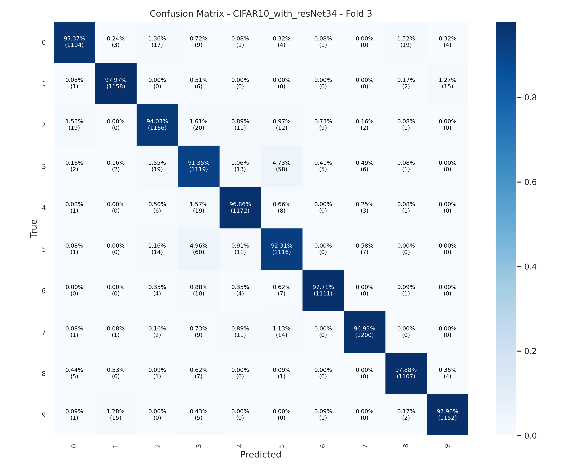
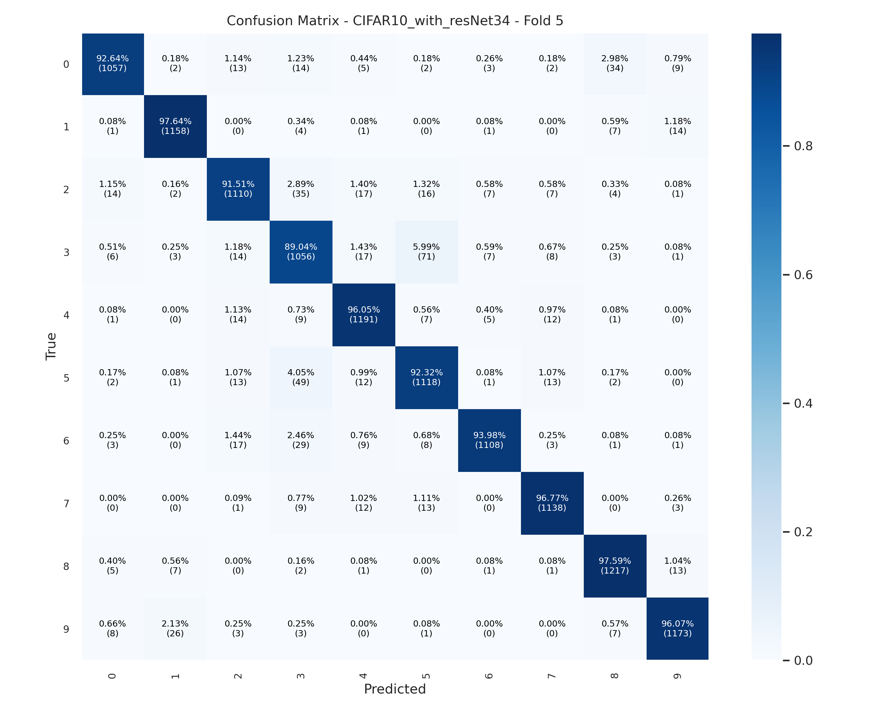

# CIFAR10 图像分类实验结果


> **📅 实验日期:** 2025-11-26 17:32 - 2025-12-03 6:17
>
> **🏷️ 任务类型:** 细粒度图像分类 (Fine-Grained Image Classification)


## 1. 实验环境 (Experimental Environment)

| 组件 | 规格/版本 | 备注 |
| :--- | :--- | :--- |
| **OS** | Ubuntu 20.04.6 LTS (命令：`cat /etc/os-release`) | |
| **GPU** | NVIDIA RTX 3090Ti (2 * 24GB) | CUDA 12.8 |
| **Framework** | torch  2.2.0+cu118 | |
| **Python** | 3.9.18 | |
| **主要库** | torchvision (0.17.0+cu118), scikit-learn, matplotlib | |

## 2. 数据集介绍 (Dataset Overview)

1、**数据集名称:** CIFAR10

2、**类别数量:** 10 类

3、**数据划分 (Split):**


原始训练集大小: `50000`张

原始验证集大小: `10000`张

CIFAR10数据集类别数量: `10`张

CIFAR10数据集类别名称: `['airplane', 'automobile', 'bird', 'cat', 'deer', 'dog', 'frog', 'horse', 'ship', 'truck']`


> 数据集划分：
>
> 将 原始训练集 和 原始验证集 合并得到一个新的数据集，然后进行5折交叉验证，保存每一折最好的结果。


4、**预处理与增强 (Preprocessing & Augmentation):**


```python
train_validation_test_transform={
        'train_transforms': transforms.Compose([
            transforms.Resize((224, 224)),
            transforms.RandomHorizontalFlip(p=0.5),
            # 引入RandAugment
            transforms.RandAugment(num_ops=2, magnitude=9),  # 调整 num_ops 和 magnitude 以控制强度
            transforms.ToTensor(),
            transforms.Normalize((0.485, 0.456, 0.406), (0.229, 0.224, 0.225)),
            # 引入RandomErasing
            transforms.RandomErasing(p=0.25, scale=(0.02, 0.33), ratio=(0.3, 3.3), value='random')  # value='random' 使用随机像素值填充
        ]),
        'validation_transforms': transforms.Compose([
            transforms.Resize((256)),
            transforms.CenterCrop((224, 224)),
            transforms.ToTensor(),
            transforms.Normalize((0.485, 0.456, 0.406), (0.229, 0.224, 0.225))
        ]),
        'test_transforms': transforms.Compose([
            transforms.Resize((256)),
            transforms.CenterCrop((224, 224)),
            transforms.ToTensor(),
            transforms.Normalize((0.485, 0.456, 0.406), (0.229, 0.224, 0.225))
        ])
    }
```


## 3. 模型架构 (Model Architecture)

**Backbone:**  Resnet34

**Pretrained Weights:**   无

**分类头 (Head):** `Linear(in_features=2048, out_features=10)`

**参数量 (Params) 和 计算量 (FLOPs)** 

```
Resnet34 on Oxford Flowers102
Command:
Params (raw): 21336998.0
Params (str): 21.34 M
MACs (raw): 3679558758.0
MACs (str): 3.68 GMac
Estimated FLOPs (2*MACs): 7359117516.0
```

**主要改进点:**

*在此描述你对模型做的特殊修改，例如添加了 Attention 模块，修改了 Dropout 率等。*

## 4. 训练细节、超参数

 (Training Details and Hyperparameter)


**Epoch:**  2000， **Batch Size:**  64， **Learning Rate:** 0.0001， **Weight Decay:**  0.002


**Optimizer:**

```python
AdamW(model.parameters(),lr=args.lr,weight_decay=args.weight_decay)
```

**LR Scheduler:**

```python
scheduler = lr_scheduler.OneCycleLR(
            optimizer,
            max_lr=opt.lr * 5,  # 峰值学习率（通常为初始lr的3~10倍）
            steps_per_epoch=len(train_loader),
            epochs=opt.epochs,
            anneal_strategy='cos',  # 余弦退火
            pct_start=0.1,          # 10% 的时间用于 warm-up
            # div_factor=25.0,        # 初始学习率 = max_lr / div_factor
            # final_div_factor=1e4,   # 最低学习率 = max_lr / final_div_factor
            # three_phase=False       # 可选：是否三阶段策略
        )
```

> 📌 OneCycleLR 可有效替代传统学习率衰减策略，兼顾快速收敛与稳定训练。


**Loss Function：**

```python
criterion = nn.CrossEntropyLoss(label_smoothing=0.1).to(device)
```

> 使用 **带 Label Smoothing 的交叉熵损失（CrossEntropyLoss）**，能够缓解模型过自信、提升泛化能力，尤其在数据噪声较多或类别不均衡时效果显著。


**其他策略：**  


| 策略                  | 说明                                                         |
| :-------------------- | :----------------------------------------------------------- |
| **Early Stopping**    | (patience = 200), 监控验证指标，若连续 **200 个 Epoch** 无提升则提前停止训练，防止过拟合 |
| **Gradient Clipping** | 对梯度进行裁剪，防止梯度爆炸，提升训练稳定性                 |
| **数据加载并行**      | (num_workers = 4), 使用 **4 个 DataLoader Worker** 加速数据读取与增强 |


> **总训练时长：156.0h 44.0m 20.54083776473999s**

## 5. 评估结果 (Evaluation Results)

### 5.1 5折交叉验证结果


| Fold     | Best Epoch | Accuracy    | Precision (micro) | Recall (micro) | Specificity | F1-score (micro) | Cohen's Kappa | Balanced Acc | AUROC   |
| -------- | ---------- | ----------- | ----------------- | -------------- | ----------- | ---------------- | ------------- | ------------ | ------- |
| 1        | 850        | 0.9461      | 0.9464            | 0.9456         | 0.994       | 0.9459           | 0.9401        | 0.9698       | 0.9938  |
| 2        | 503        | 0.9461      | 0.9467            | 0.946          | 0.994       | 0.9462           | 0.9401        | 0.97         | 0.9942  |
| 3        | 1741       | 0.9579      | 0.9587            | 0.9584         | 0.9953      | 0.9585           | 0.9532        | 0.9768       | 0.995   |
| 4        | 1816       | 0.9607      | 0.9614            | 0.9607         | 0.9956      | 0.961            | 0.9563        | 0.9782       | 0.9956  |
| 5        | 561        | 0.9438      | 0.9443            | 0.9436         | 0.9938      | 0.9438           | 0.9376        | 0.9687       | 0.995   |
| **Mean** | -          | 0.95092     | 0.9515            | 0.95086        | 0.99454     | 0.95108          | 0.94546       | 0.9727       | 0.99472 |
| **Std**  | -          | 0.006950223 | 0.007081525       | 0.007178746    | 0.000752596 | 0.007170886      | 0.007702623   | 0.003968879  | 0.00064 |


## 6. 可视化分析 (Visualization Analysis)

### 6.1 混淆矩阵 (Confusion Matrix)

5折交叉验证混淆矩阵：


Fold 1：


Fold 2：


Fold 3：





Fold 4：


Fold 5：




